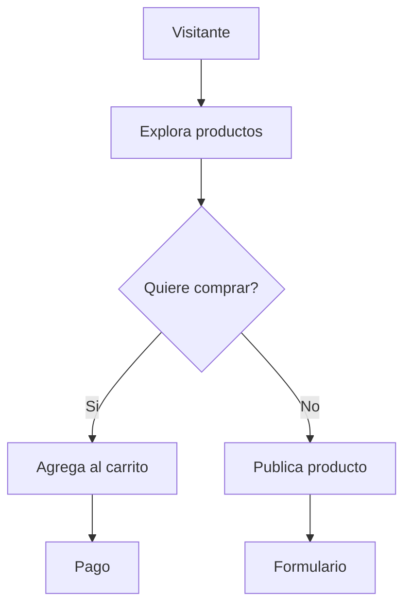

# Análisis de Tecnologías y Modelo de Despliegue

## Comparación de frameworks

### Node.js / NestJS
- **Ventajas**: unifica JavaScript/TypeScript en frontend y backend, buen rendimiento en I/O, ecosistema amplio.
- **Desventajas**: curva de aprendizaje para patrones avanzados, requiere más configuración para funcionalidades comunes.

### Django
- **Ventajas**: framework completo, incluye admin automático, ORM y seguridad integrada.
- **Desventajas**: más pesado para microservicios pequeños, menor rendimiento en tareas altamente concurrentes.

### Ruby on Rails
- **Ventajas**: filosofía "convention over configuration", rapidez para prototipos, comunidad madura.
- **Desventajas**: rendimiento menor en procesos intensivos, ecosistema más reducido en comparación con Node.

## Comparación de bases de datos

### PostgreSQL
- **Ventajas**: relacional, ACID, soporte para consultas complejas y extensiones (PostGIS, JSONB).
- **Desventajas**: mayor complejidad al escalar horizontalmente.

### MongoDB
- **Ventajas**: esquema flexible orientado a documentos, fácil escalado horizontal.
- **Desventajas**: no garantiza transacciones complejas fuera de una sola colección, consistencia eventual por defecto.

## Prototipo de flujos (Mermaid)

Este diagrama puede trasladarse a Figma para diseño de interfaces y prototipos visuales.

## Modelo de despliegue

### Monolito
- **Pros**: simplicidad de desarrollo y despliegue, menor sobrecarga operativa.
- **Contras**: escalado y despliegues más difíciles a medida que crece el proyecto.

### Microservicios
- **Pros**: escalado independiente, libertad tecnológica por servicio.
- **Contras**: mayor complejidad de infraestructura y comunicación entre servicios.

**Recomendación**: iniciar con un monolito (por ejemplo, Django o NestJS) para el MVP y evolucionar a microservicios cuando la plataforma requiera escalado o modularidad adicional.
